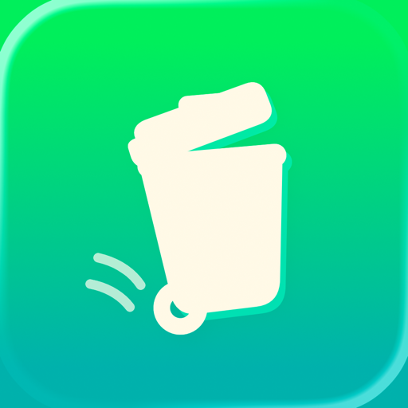
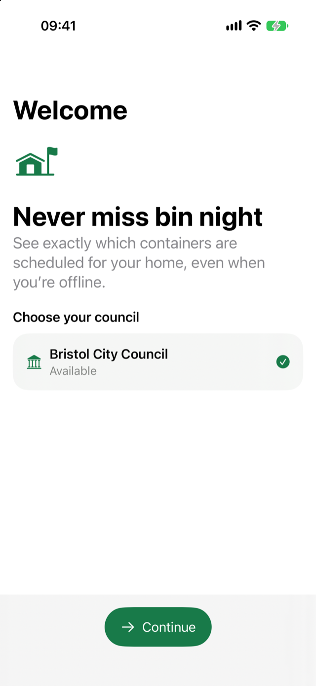
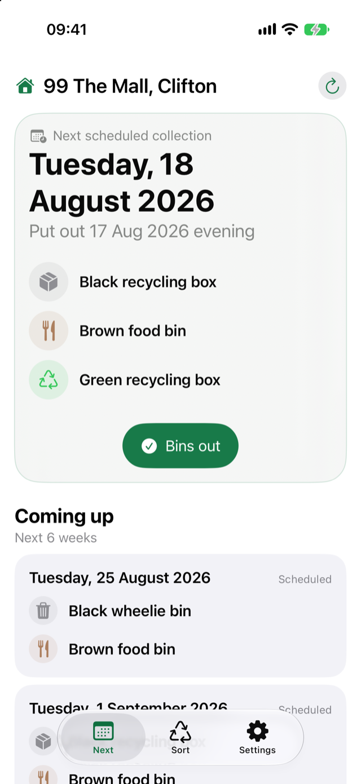
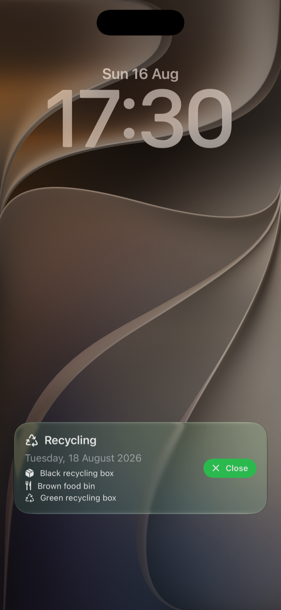
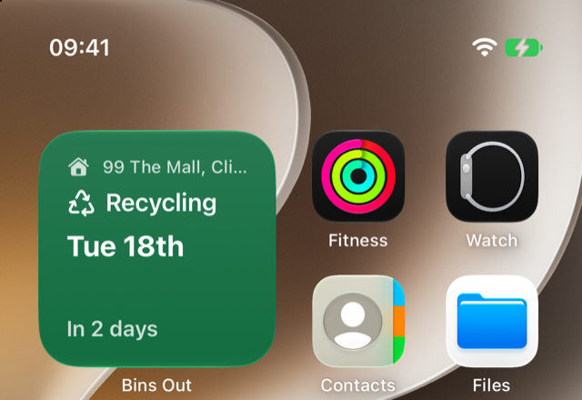

# Get yer Bins Out

**Never miss bin night.** Property-specific Bristol bin and recycling collection days, on your iPhone.

- **Bin night reminders** — an opt-in notification the evening before, and a Live Activity on your Lock Screen from the evening before through the morning of collection day.
- **Home Screen widgets** — the next collection, what goes out, and a `Today` / `Tomorrow` / `In N days` countdown, in small and medium sizes.
- **Sorting info** — concise cards for Bristol's containers, linking straight to the council's official guidance.
- **Calendar integration** — opt-in all-day events in a calendar you choose, kept in step with the schedule automatically.
- **Ask Siri** — your next collection, when to put the containers out, and where Bristol glass goes.
- **On-device and private** — no account, no analytics, no backend of ours. Only your property's UPRN leaves the phone, straight to Bristol City Council.

## Screenshots

| Onboarding | Next collection |
| --- | --- |
|  |  |
| **Live Activity** | **Small widget** |
|  |  |

<details>
<summary><strong>Everything else — what works, privacy, limitations, and how to build</strong></summary>

## About

Get yer Bins Out is a native iOS 27 SwiftUI app for property-specific Bristol bin and recycling collection days. It talks directly to Bristol City Council, keeps the last good schedule on-device, and has no developer-operated backend, analytics SDK, postcode lookup, or location access.

## What works

- Onboarding selects a council, validates an exact UPRN string, lets the user choose a private property label, previews the returned schedule, and saves it locally. Bristol City Council is currently the only provider.
- Next groups containers on the same `Europe/London` local date, keeps cached data after transient failures, shows six weeks by default, and expands to the provider-backed 24-week view without inventing recurrence.
- Sort presents concise Bristol container cards and links to official council guidance rather than copying a council sorting database.
- Settings manages the saved property, data freshness, local reminders, Live Activities, and hands-off selected-calendar synchronization.
- Small and medium widgets read a UPRN-free App Group payload. They use semantic recycling/bin/garden backgrounds, show the property, collection type, short date and a `Today` / `Tomorrow` / `In N days` countdown, and keep the full medium-size "Put out" list.
- App Intents answer the next collection, when containers should go out, and Bristol glass-bottle sorting questions from the same privacy-minimised App Group payload. A separate shortcut opens the official glass guidance.
- Deterministic previews cover the app's major states, both widget families, and Lock Screen plus Dynamic Island Live Activity presentations without networking or permissions.

## Data and privacy

Normal app launches use `BristolCollectionProvider`. Previews and unit tests inject deterministic fixtures, and developers can launch with `BINS_OUT_USE_FIXTURE=1` for deliberate offline work.

The Bristol API credential is council-authorized public client configuration, centralized in `BristolAPIConfiguration`, and necessarily extractable from the binary. Bristol must protect it operationally through endpoint scope, quotas, monitoring, revocation, and rotation—not obfuscation. The app does not log it.

The live request sends only the exact user-entered UPRN string to Bristol's approved `NextCollectionDates` endpoint. The widget and Siri payload contains the local property label, scheduled local dates, container labels, and freshness state, but no UPRN, credential, raw response, or EventKit data. The selected property can sync through iCloud Keychain; the schedule cache remains local/App Group data.

## System features

- Evening reminders are opt-in local notifications, defaulting to 17:45 on the evening before collection. Notification permission is requested only after the user enables reminders.
- The opt-in Live Activity covers 18:00 on the evening before through 09:00 on collection day. It uses two linked pre-scheduled segments so each remains within iOS's eight-hour limit; local notifications remain the reliable fallback. The shared `Bins out` action records only that the user put containers out and can be undone in the app.
- Settings includes an isolated, immediately-started Live Activity preview. Closing it does not complete or cancel a real occurrence.
- Calendar sync requests full EventKit access only after opt-in and uses Apple's writable single-calendar chooser. Once a calendar is selected, reconciliation runs automatically after selection, app load/activation, schedule refreshes, and EventKit store changes. It creates individual all-day events only through Bristol's authoritative horizon, updates changed dates or container details, removes obsolete future managed events, and suppresses user-deleted events rather than silently recreating them.

The app and WidgetKit extension use the `group.com.samuelgiles.BinsOut` App Group. Configure that capability for both bundle identifiers in the signing team before device testing.

Both the app and the widget extension ship a `PrivacyInfo.xcprivacy`. Neither declares a required-reason API, because neither uses one: there is no `UserDefaults` or `@AppStorage` anywhere in the project, and persistence uses `FileManager.fileExists(atPath:)`, `Data(contentsOf:)`, and `Data.write(to:options:)`, none of which are covered APIs. [PRIVACY.md](PRIVACY.md) is the public, plain-English version.

## Known limitations and future work

These are intended behaviours that the current code does **not** implement. They are listed separately from "What works" on purpose — nothing in this section is shipped.

### Automatic freshness

- **Today:** the app reconciles widgets, notifications, Live Activities, and calendar events from whatever snapshot is already saved. A refresh happens when the user pulls to refresh or completes onboarding.
- **Not implemented:** the app does not automatically fetch a newer Bristol schedule whenever it becomes active. A saved schedule can therefore be silently out of date, and the UI's freshness indicator is the only signal.
- **Intended work:** a rate-limited foreground freshness policy so activation triggers at most one request per interval; a tighter near-horizon refresh as a collection approaches; retention of the last good cache so a failed refresh never blanks the screen; and opportunistic `BGAppRefresh` scheduling. Background refresh must be treated as a best-effort bonus, never as an alarm — iOS gives no delivery guarantee, so local notifications remain the reliable mechanism.
- **Consequence to keep in mind:** because reconciliation only ever works from the saved snapshot, a change Bristol makes to a collection date can only be discovered after a new provider snapshot has actually been obtained. Calendar events, reminders, and Live Activities cannot correct themselves before that happens.

### Live Activity alert window

- **Desired product window:** 18:00 the evening before a collection through 09:00 on collection day — 15 hours.
- **Platform constraint:** iOS limits a single Live Activity to eight active hours, so the window cannot be covered by one activity.
- **Today:** the window is covered by two pre-scheduled linked segments, each within the eight-hour limit. Every scheduled segment requires a system alert when it begins, so with the present split the second segment risks producing a second alert overnight — exactly when a user does not want one.
- **This is not solved.** The product compromise still has to be chosen (fewer segments and a shorter window, a differently placed split, or accepting the second alert), and whatever is chosen must be validated on physical hardware. Simulator runs do not reproduce the real scheduling and alerting behaviour.

### Data deletion

- There is no in-app "erase all data" flow. Deleting the app clears its App Group container, but the synchronizable iCloud Keychain property record can persist across reinstalls and on other devices, and calendar events are retained whenever the user chooses to keep them on disabling sync. See the retention section of [PRIVACY.md](PRIVACY.md), which documents this honestly rather than promising deletion the code does not perform.

## Build and test

Use the Xcode 27 toolchain and an iOS 27 simulator:

```sh
DEVELOPER_DIR=/Applications/Xcode-beta.app/Contents/Developer \
  xcodebuild -project BinsOut.xcodeproj -scheme BinsOut \
  -destination 'platform=iOS Simulator,name=iPhone 17 Pro,OS=27.0' build

DEVELOPER_DIR=/Applications/Xcode-beta.app/Contents/Developer \
  xcodebuild -project BinsOut.xcodeproj -scheme BinsOut \
  -destination 'platform=iOS Simulator,name=iPhone 17 Pro,OS=27.0' test
```

The default test run is deterministic. The live Bristol XCTest is skipped unless an authorized developer locally supplies both `BINS_OUT_RUN_LIVE_TESTS=1` and `BINS_OUT_LIVE_TEST_UPRN`; never add a real property identifier or address to source, schemes, fixtures, snapshots, screenshots, or logs.

Simulator builds cover compilation and pure reconciliation behavior. Notification delivery, the overnight Live Activity handoff, locked-device intent authentication, App Group signing, widget placement, Siri phrasing, and EventKit UI still need physical-device checks before release.

</details>
